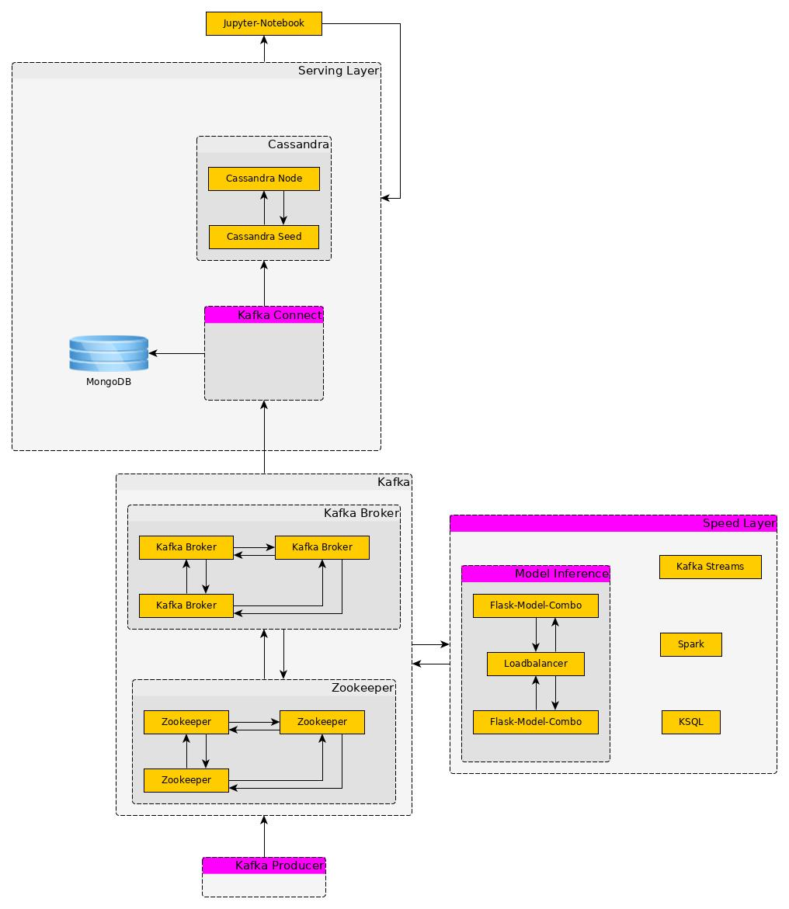

# Big Data Science Platform

## Komponenten

**Kafka Cluster**

todo: Kafka Stream in Python mit [winton-kafka-streams](https://github.com/wintoncode/winton-kafka-streams)

- 3 Zookeeper
- 3 Kafka Broker

**Cassandra Cluster**

- 2 Node Cluster

**Spark Cluster**

Single Node ? 

**Jupyter Notebook**

Mit Setup und Test Notebooks für die einelnen Komponenten

**H2O**

**Mongo DB**

## Setup

* Generiere die Docker Images mittels `bootstrap_images.sh` 
* Starte den Stack mittels `docker-compose up -d`
* Hole die Verbindungs URL mittels `docker-compose logs jupyter_spark | grep token`
* Führe das Setup Notebook unter `notebooks/Setup` aus

